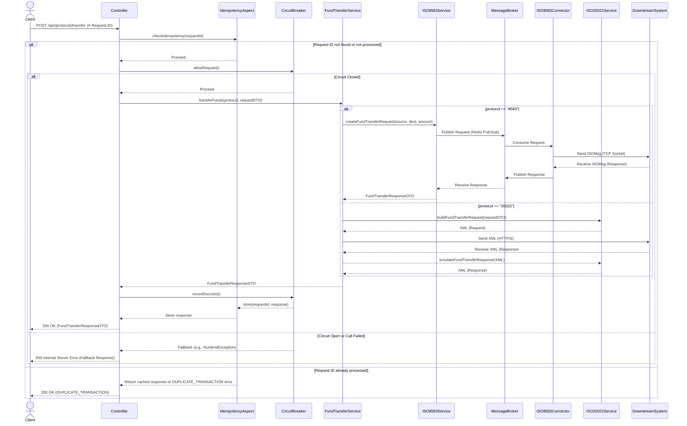

# Batavia Middleware Architecture Documentation

This document details the software architecture of the Batavia middleware, following an arc42-inspired structure to provide a comprehensive overview for all stakeholders.

---

## 1. Introduction and Goals

### 1.1. Introduction
The Batavia middleware is a production-style banking middleware that demonstrates how modern digital channels integrate with core banking systems and payment networks using ISO 8583 and ISO 20022. It is designed for high-volume, 24/7 financial operations.

This repository is a **showcase project** that demonstrates real-world banking middleware design and engineering practices, inspired by production experience in a regulated banking environment.

All external dependencies such as **core banking systems, payment switches, and networks are mocked**, while preserving:
- Realistic transaction flows
- Architectural decisions
- Failure handling strategies
- Compliance-aware design

This project is **not a simulator of a specific bank**, but a **transferable reference architecture**.

### 1.2. Goals (What This Middleware Solves)
The primary goals of the Batavia middleware are to:
- **Connect Multiple Channels to Core Banking**: Provide a clean REST/JSON API for mobile & web banking, partner APIs, and internal services, abstracting direct interaction with core systems.
- **Standardize Communication**: Isolate all protocol complexity (ISO 8583 for legacy, ISO 20022 for modern real-time payments) within the middleware.
- **Handle High-Volume Transactions Safely**: Ensure sustained high Transactions Per Second (TPS) with correctness, traceability, and stability, prioritizing financial safety over raw throughput.

---

## 2. Context and Scope

### 2.1. System Context
The Batavia middleware acts as a central hub, integrating various digital channels with mocked core banking systems and payment networks.

```plantuml
@startuml
!include https://raw.githubusercontent.com/plantuml-stdlib/C4-PlantUML/master/C4_Context.puml

title C4 Context Diagram for Batavia Middleware

Person(customer, "Customer", "A customer of the bank using digital channels.")
System(mobile_app, "Mobile Banking App", "Allows customers to manage their accounts and initiate transactions.")
System(web_app, "Web Banking App", "Provides online banking services to customers.")
System(partner_api, "Partner API", "External systems that integrate with the bank's services.")

System_Boundary(batavia_middleware, "Batavia Middleware") {
    System(batavia, "Batavia Middleware", "The core banking middleware service.")
}

System(legacy_switch, "Legacy ISO 8583 Switch", "Handles ISO 8583 transactions with core banking and payment networks.")
System(iso20022_engine, "ISO 20022 Payment Engine", "Processes modern real-time payments (e.g., BI-FAST).")

Rel(customer, mobile_app, "Uses")
Rel(customer, web_app, "Uses")
Rel(mobile_app, batavia, "Sends REST/JSON requests to", "HTTPS")
Rel(web_app, batavia, "Sends REST/JSON requests to", "HTTPS")
Rel(partner_api, batavia, "Sends REST/JSON requests to", "HTTPS")

Rel(batavia, legacy_switch, "Communicates with", "ISO 8583 (TCP/IP)")
Rel(batavia, iso20022_engine, "Communicates with", "ISO 20022 (HTTP/XML)")

@enduml
```

### 2.2. External Interfaces
- **Inbound**: REST/JSON API (HTTP/HTTPS) from various digital channels.
- **Outbound**:
    - ISO 8583 (TCP/IP) to legacy payment networks/switches.
    - ISO 20022 (HTTP/XML) to modern real-time payment engines.

### 2.3. Stakeholders
- **Author**: Paulus Slamet Widodo (Wied) - Senior Software Engineer / Engineering Manager
- **Developers**: Anyone extending or maintaining the middleware.
- **Operators**: Responsible for deploying, monitoring, and maintaining the system in production.
- **Business Analysts**: Defining transaction flows and requirements.
- **Security Auditors**: Ensuring compliance and security standards.

---

## 3. Solution Strategy

The Batavia middleware adopts a layered, API-driven architectural style with a strong focus on resilience, scalability, and compliance.

### 3.1. Key Characteristics
- **Stateless API layer**: Facilitates horizontal scaling.
- **Transaction-aware processing**: Ensures correctness and traceability.
- **Horizontal scalability**: Designed for high-volume transactions.
- **24/7 availability**: Built with production-grade failure handling.
- **Compliance-aware design**: Incorporates security and auditability from the ground up.

### 3.2. Architectural Drivers
- **High-Volume Transactions**: The system must handle sustained high TPS.
- **24/7 Availability**: Minimal downtime is critical for financial operations.
- **Compliance**: Adherence to banking regulations (e.g., PII, PCI-DSS).
- **Resilience**: The system must gracefully handle failures in downstream systems.
- **Interoperability**: Seamless integration with diverse legacy and modern systems.

---

## 4. Building Block View (C4 Model)

### 4.1. C4 Context Diagram
This diagram illustrates the Batavia Middleware as a "System" in its environment, showing how users and other systems interact with it at a high level.

```plantuml
@startuml
!include https://raw.githubusercontent.com/plantuml-stdlib/C4-PlantUML/master/C4_Context.puml

title C4 Context Diagram for Batavia Middleware

Person(customer, "Customer", "A customer of the bank using digital channels.")
System(mobile_app, "Mobile Banking App", "Allows customers to manage their accounts and initiate transactions.")
System(web_app, "Web Banking App", "Provides online banking services to customers.")
System(partner_api, "Partner API", "External systems that integrate with the bank's services.")

System_Boundary(batavia_middleware, "Batavia Middleware") {
    System(batavia, "Batavia Middleware", "The core banking middleware service.")
}

System(legacy_switch, "Legacy ISO 8583 Switch", "Handles ISO 8583 transactions with core banking and payment networks.")
System(iso20022_engine, "ISO 20022 Payment Engine", "Processes modern real-time payments (e.g., BI-FAST).")

Rel(customer, mobile_app, "Uses")
Rel(customer, web_app, "Uses")
Rel(mobile_app, batavia, "Sends REST/JSON requests to", "HTTPS")
Rel(web_app, batavia, "Sends REST/JSON requests to", "HTTPS")
Rel(partner_api, batavia, "Sends REST/JSON requests to", "HTTPS")

Rel(batavia, legacy_switch, "Communicates with", "ISO 8583 (TCP/IP)")
Rel(batavia, iso20022_engine, "Communicates with", "ISO 20022 (HTTP/XML)")

@enduml
```

### 4.2. C4 Container Diagram
This diagram shows the high-level technology containers within the Batavia Middleware system and how they interact with each other and with external systems.

```plantuml
@startuml
!include https://raw.githubusercontent.com/plantuml-stdlib/C4-PlantUML/master/C4_Container.puml

title C4 Container Diagram for Batavia Middleware

Person(customer, "Customer", "A customer of the bank using digital channels.")
System(mobile_app, "Mobile Banking App", "Allows customers to manage their accounts and initiate transactions.")
System(web_app, "Web Banking App", "Provides online banking services to customers.")
System(partner_api, "Partner API", "External systems that integrate with the bank's services.")

System_Boundary(batavia_middleware_system, "Batavia Middleware System") {
    Container(batavia_api, "Batavia API", "Spring Boot Application (Java 17)", "Provides RESTful API for digital channels. Handles routing, idempotency, resilience, and protocol mapping.")
    Container(iso8583_connector, "ISO 8583 Connector", "Spring Boot Application (Java 17)", "Dedicated service for managing a single, persistent TCP connection to the legacy ISO 8583 switch. Communicates asynchronously via Redis/SQS.")
    Container(redis, "Redis", "Redis (ElastiCache)", "Distributed cache/message broker for idempotency store and asynchronous communication with ISO 8583 Connector.")
}

System(legacy_switch, "Legacy ISO 8583 Switch", "Handles ISO 8583 transactions with core banking and payment networks.")
System(iso20022_engine, "ISO 20022 Payment Engine", "Processes modern real-time payments (e.g., BI-FAST).")

Rel(customer, mobile_app, "Uses")
Rel(customer, web_app, "Uses")
Rel(mobile_app, batavia_api, "Sends REST/JSON requests to", "HTTPS")
Rel(web_app, batavia_api, "Sends REST/JSON requests to", "HTTPS")
Rel(partner_api, batavia_api, "Sends REST/JSON requests to", "HTTPS")

Rel(batavia_api, redis, "Reads/Writes idempotency data, Publishes/Subscribes ISO 8583 messages", "TCP")
Rel(iso8583_connector, redis, "Subscribes to ISO 8583 requests, Publishes responses", "TCP")

Rel(batavia_api, iso20022_engine, "Communicates with", "ISO 20022 (HTTP/XML)")
Rel(iso8583_connector, legacy_switch, "Maintains single connection and sends/receives", "ISO 8583 (TCP/IP)")

@enduml
```

### 4.3. C4 Component Diagram (Batavia API Container)
This diagram illustrates the internal components of the `Batavia API` Spring Boot application, showing how they collaborate to fulfill the middleware's responsibilities.

```plantuml
@startuml
!include https://raw.githubusercontent.com/plantuml-stdlib/C4-PlantUML/master/C4_Component.puml

title C4 Component Diagram for Batavia API Container

Container(batavia_api, "Batavia API", "Spring Boot Application (Java 17)", "Provides RESTful API for digital channels. Handles routing, idempotency, resilience, and protocol mapping.") {

    Component(customer_controller, "CustomerController", "Spring @RestController", "Handles customer-related REST API requests (e.g., balance inquiry).")
    Component(fund_transfer_controller, "FundTransferController", "Spring @RestController", "Handles fund transfer REST API requests.")

    Component(idempotency_aspect, "IdempotencyAspect", "Spring @Aspect", "Intercepts requests to enforce idempotency using X-Request-ID header.")
    Component(circuit_breaker_aspect, "CircuitBreakerAspect", "Spring @Aspect (Resilience4j)", "Applies circuit breaker patterns to service calls for resilience.")
    Component(retry_aspect, "RetryAspect", "Spring @Aspect (Spring Retry)", "Applies retry logic to service calls for transient fault handling.")

    Component(fund_transfer_service, "FundTransferService", "Spring @Service", "Orchestrates fund transfer business logic, routes to appropriate ISO service.")
    Component(customer_8583_service, "Customer8583Service", "Spring @Service", "Handles customer balance inquiries via ISO 8583 protocol.")
    Component(customer_20022_service, "Spring @Service", "Handles customer balance inquiries via ISO 20022 protocol.")
    Component(idempotency_service, "IdempotencyService", "Spring @Service", "Interface for idempotency store operations (e.g., InMemoryIdempotencyService).")

    Component(iso8583_adapter, "ISO8583Service", "Spring @Service", "Adapts internal DTOs to ISO 8583 messages and interacts with the ISO 8583 Connector.")
    Component(iso20022_adapter, "ISO20022Service", "Spring @Service", "Adapts internal DTOs to ISO 20022 messages and interacts with the ISO 20022 Payment Engine.")

    Rel(customer_controller, customer_8583_service, "Uses", "Java API")
    Rel(customer_controller, customer_20022_service, "Uses", "Java API")
    Rel(fund_transfer_controller, fund_transfer_service, "Uses", "Java API")

    Rel(customer_8583_service, iso8583_adapter, "Uses", "Java API")
    Rel(customer_20022_service, iso20022_adapter, "Uses", "Java API")
    Rel(fund_transfer_service, iso8583_adapter, "Uses", "Java API")
    Rel(fund_transfer_service, iso20022_adapter, "Uses", "Java API")

    Rel(idempotency_aspect, idempotency_service, "Uses", "Java API")

    Rel_U(customer_controller, idempotency_aspect, "Applies to", "AOP")
    Rel_U(fund_transfer_controller, idempotency_aspect, "Applies to", "AOP")
    Rel_U(fund_transfer_service, circuit_breaker_aspect, "Applies to", "AOP")
    Rel_U(customer_8583_service, circuit_breaker_aspect, "Applies to", "AOP")
    Rel_U(customer_20022_service, circuit_breaker_aspect, "Applies to", "AOP")
    Rel_U(fund_transfer_service, retry_aspect, "Applies to", "AOP")
    Rel_U(customer_8583_service, retry_aspect, "Applies to", "AOP")
    Rel_U(customer_20022_service, retry_aspect, "Applies to", "AOP")
}

Container_Ext(redis, "Redis", "Distributed Cache/Message Broker")
Container_Ext(iso8583_connector, "ISO 8583 Connector", "Spring Boot Application")
System_Ext(iso20022_engine, "ISO 20022 Payment Engine", "External System")

Rel(iso8583_adapter, iso8583_connector, "Sends/Receives ISO 8583 messages via", "Redis/SQS")
Rel(iso20022_adapter, iso20022_engine, "Sends/Receives ISO 20022 messages", "HTTP/XML")
Rel(idempotency_service, redis, "Stores/Retrieves idempotency keys and responses", "TCP")

@enduml
```

---

## 5. Runtime View (C4 Model: Sequence Diagram)

This sequence diagram illustrates the runtime flow of a **Fund Transfer** request, highlighting the interaction between the middleware's internal components and external systems.



### Flow Explanation:
1.  **Client Request**: The client sends a `POST` request to the API Gateway (Controller) with a unique `X-Request-ID` header.
2.  **Idempotency Check**: The `IdempotencyAspect` intercepts the call.
    - If the `X-Request-ID` has been seen and processed successfully before, it immediately returns the cached response or a `DUPLICATE_TRANSACTION` error.
    - If it's a new request, it proceeds.
3.  **Circuit Breaker Check**: The `CircuitBreaker` aspect (Resilience4j) checks the health of the downstream system.
    - If the circuit is `OPEN` (downstream is failing), it immediately triggers a fallback.
    - If the circuit is `CLOSED` or `HALF_OPEN`, it allows the request to proceed.
4.  **Service Logic**: The `FundTransferService` is invoked, routing the request based on the specified `protocol`.
5.  **Protocol Mapping & Downstream Call**:
    - **ISO 8583**: The `ISO8583Service` constructs the ISO message, which is then sent to the `DownstreamSystem` (mocked switch). The response is received and parsed.
    - **ISO 20022**: The `ISO20022Service` constructs the ISO 20022 XML message, which is then sent to the `DownstreamSystem` (mocked payment engine). The response is received and parsed.
6.  **Response Handling**: The `FundTransferService` processes the protocol-specific response and maps it to a `FundTransferResponseDTO`.
7.  **Aspects (Post-Execution)**:
    - The `CircuitBreaker` records the outcome (success/failure) to update its state.
    - The `IdempotencyAspect` stores the successful response associated with the `X-Request-ID` for future duplicate requests.
8.  **Client Response**: The final `FundTransferResponseDTO` is returned to the client.

---

## 6. Deployment View (C4 Model: Deployment Level)

The Batavia middleware is designed for deployment on cloud-native platforms, specifically AWS ECS Fargate, leveraging containerization and managed services for scalability, resilience, and operational efficiency.

For a detailed guide on the recommended AWS deployment architecture, including infrastructure components, deployment steps, and CI/CD pipelines, please refer to the **[AWS Cloud Deployment Guide](./CLOUD_DEPLOYMENT.md)**.

### Handling ISO 8583 Single TCP Connection in Cloud
A critical aspect of the deployment view, especially for ISO 8583 integration, is managing the single, persistent TCP connection requirement of legacy systems. This is addressed using the "Connector Pattern". For a comprehensive explanation of this pattern and its implementation, refer to the **[ISO 8583 Networking Guide](./ISO8583_NETWORK.md)**.

```plantuml
@startuml
!include https://raw.githubusercontent.com/plantuml-stdlib/C4-PlantUML/master/C4_Deployment.puml

title C4 Deployment Diagram for Batavia Middleware (AWS ECS Fargate)

Deployment_Node("AWS Region", "us-east-1") {
    Deployment_Node("VPC", "Virtual Private Cloud") {

        Deployment_Node("Public Subnets", "Contain internet-facing resources") {
            Deployment_Node("Application Load Balancer (ALB)", "Entry point for HTTP/S traffic") {
                Container(alb_listener, "ALB Listener", "HTTPS (443)", "Routes traffic to Batavia API")
            }
            Deployment_Node("NAT Gateway", "Provides static egress IP for private subnets") {
                Component(nat_eip, "Elastic IP", "Static Public IP", "Whitelisted by Legacy ISO 8583 Switch")
            }
        }

        Deployment_Node("Private Subnets", "Contain application and data resources") {
            Deployment_Node("ECS Cluster", "ECS Fargate Cluster") {
                Deployment_Node("ECS Service (Batavia API)", "Scalable Service (N instances)") {
                    Container(batavia_api_instance, "Batavia API Instance", "Spring Boot App", "Handles REST, Idempotency, Protocol Mapping")
                    Container(batavia_api_instance_2, "Batavia API Instance", "Spring Boot App", "...")
                    ' ... N instances
                }
                Deployment_Node("ECS Service (ISO 8583 Connector)", "Singleton Service (1 instance)") {
                    Container(iso8583_connector_instance, "ISO 8583 Connector Instance", "Spring Boot App", "Manages single TCP connection to Legacy Switch")
                }
            }
            Deployment_Node("Redis (ElastiCache)", "Managed Redis Cluster") {
                Container(redis_cluster, "Redis Cluster", "Distributed Cache/Message Broker", "Idempotency Store, ISO 8583 Message Queue")
            }
        }
    }
}

System_Ext(legacy_switch, "Legacy ISO 8583 Switch", "External banking system requiring single TCP connection from static IP.")
System_Ext(iso20022_engine, "ISO 20022 Payment Engine", "External real-time payment system (HTTP/XML).")

Rel(alb_listener, batavia_api_instance, "Routes HTTP/S traffic to", "HTTPS")
Rel(batavia_api_instance, redis_cluster, "Reads/Writes idempotency data, Publishes ISO 8583 requests", "TCP")
Rel(iso8583_connector_instance, redis_cluster, "Subscribes to ISO 8583 requests, Publishes responses", "TCP")
Rel(iso8583_connector_instance, nat_eip, "Routes outbound traffic through", "TCP")
Rel(nat_eip, legacy_switch, "Connects to", "ISO 8583 (TCP/IP)")
Rel(batavia_api_instance, iso20022_engine, "Communicates with", "ISO 20022 (HTTP/XML)")

@enduml
```

---

## 7. Architectural Decisions (ADRs)

Key architectural decisions are documented as Architectural Decision Records (ADRs). These provide context, alternatives considered, and the rationale behind significant design choices.

- **[ADR 0001: Adoption of ISO 8583 Connector Pattern](./adr/0001-iso8583-connector-pattern.md)**: Decision to decouple the scalable API layer from the single TCP connection requirement of legacy ISO 8583 switches.

---

## 8. Quality Requirements

The following non-functional requirements are critical for the Batavia middleware:
- **Performance**: Designed for sustained high TPS.
- **Availability**: 24/7 operation with production-grade failure handling.
- **Security**: Compliance with banking security standards (PII, PCI-DSS).
- **Maintainability**: Clear architecture, well-documented code, and test coverage.
- **Scalability**: Ability to handle increasing transaction volumes by horizontal scaling.

---

## 9. Risks and Technical Debts

- **Mocked External Systems**: All core banking and payment networks are mocked. Real integration would introduce complexities not covered in this showcase.
- **In-Memory Idempotency Store**: The current `InMemoryIdempotencyService` is not suitable for horizontally scaled production environments. It should be replaced with a distributed store (e.g., Redis) for true scalability.
- **Simplified Error Handling**: While error codes are defined, detailed error handling and client-specific error messages are simplified for the showcase.
- **Schema Validation**: ISO 20022 schema validation is mocked. A real implementation would require robust XML schema validation.

---

## 11. Glossary

- **ALB**: Application Load Balancer
- **AOP**: Aspect-Oriented Programming
- **CPSA**: Certified Professional for Software Architecture
- **ECS**: Elastic Container Service
- **EIP**: Elastic IP
- **EOD**: End-of-Day
- **HTTPS**: Hypertext Transfer Protocol Protocol Secure
- **ISO 8583**: International Organization for Standardization 8583 (Financial transaction card originated messages)
- **ISO 20022**: International Organization for Standardization 20022 (Universal financial industry message scheme)
- **MTI**: Message Type Indicator (ISO 8583)
- **NAT Gateway**: Network Address Translation Gateway
- **PII**: Personally Identifiable Information
- **PCI-DSS**: Payment Card Industry Data Security Standard
- **POJO**: Plain Old Java Object
- **RRN**: Retrieval Reference Number
- **SQS**: Simple Queue Service
- **STAN**: System Trace Audit Number
- **TCP/IP**: Transmission Control Protocol/Internet Protocol
- **TLS**: Transport Layer Security
- **TPS**: Transactions Per Second
- **VPC**: Virtual Private Cloud
- **WAF**: Web Application Firewall
- **XML**: Extensible Markup Language
- **XSS**: Cross-Site Scripting

---
