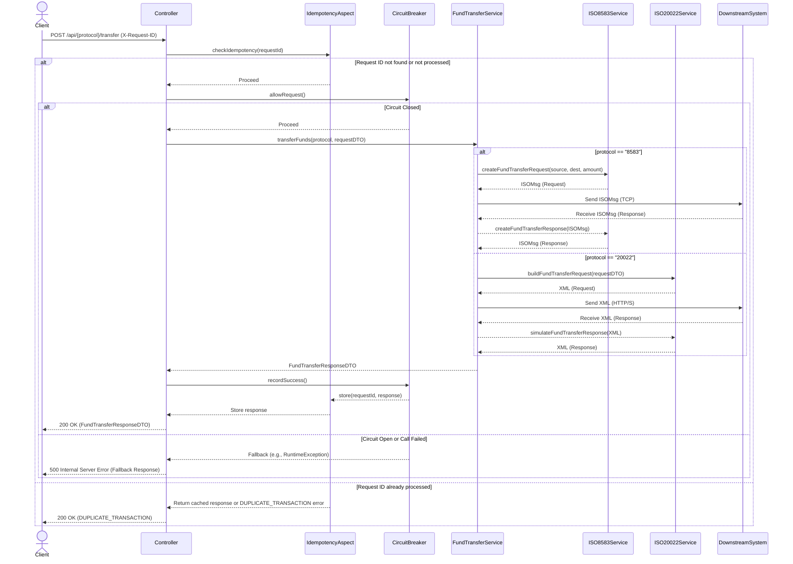

# Batavia Middleware Architecture Documentation

This document details the software architecture of the Batavia middleware, following an arc42-inspired structure to provide a comprehensive overview for all stakeholders.

---

## 1. Introduction and Goals

### 1.1. Introduction
The Batavia middleware is a production-style banking middleware that demonstrates how modern digital channels integrate with core banking systems and payment networks using ISO 8583 and ISO 20022. It is designed for high-volume, 24/7 financial operations.

This repository is a **showcase project** that demonstrates real-world banking middleware design and engineering practices, inspired by production experience in a regulated banking environment.

All external dependencies such as **core banking systems, payment switches, and networks are mocked**, while preserving:
- Realistic transaction flows
- Architectural decisions
- Failure handling strategies
- Compliance-aware design

This project is **not a simulator of a specific bank**, but a **transferable reference architecture**.

### 1.2. Goals (What This Middleware Solves)
The primary goals of the Batavia middleware are to:
- **Connect Multiple Channels to Core Banking**: Provide a clean REST/JSON API for mobile & web banking, partner APIs, and internal services, abstracting direct interaction with core systems.
- **Standardize Communication**: Isolate all protocol complexity (ISO 8583 for legacy, ISO 20022 for modern real-time payments) within the middleware.
- **Handle High-Volume Transactions Safely**: Ensure sustained high Transactions Per Second (TPS) with correctness, traceability, and stability, prioritizing financial safety over raw throughput.

---

## 2. Context and Scope

### 2.1. System Context
The Batavia middleware acts as a central hub, integrating various digital channels with mocked core banking systems and payment networks.

```
+-----------------------------------------------------------------+
|                                                                 |
|  [ Channels / Clients (Web, Mobile, Partner API) ]              |
|                                                                 |
+-----------------------------------------------------------------+
                         |
                 (REST / JSON over HTTPS)
                         |
+------------------------V----------------------------------------+
|                                                                 |
|  [ Batavia Middleware ]                                         |
|                                                                 |
+-----------------------------------------------------------------+
                         |
         (TCP/IP for ISO 8583, HTTP/XML for ISO 20022)
                         |
+------------------------V----------------------------------------+
|                                                                 |
|  [ Mocked Downstream Systems ]                                  |
|   - Core Banking System                                         |
|   - Payment Switch (e.g., Artajasa, Rintis)                     |
|                                                                 |
+-----------------------------------------------------------------+
```

### 2.2. External Interfaces
- **Inbound**: REST/JSON API (HTTP/HTTPS) from various digital channels.
- **Outbound**:
    - ISO 8583 (TCP/IP) to legacy payment networks/switches.
    - ISO 20022 (HTTP/XML) to modern real-time payment engines.

### 2.3. Stakeholders
- **Author**: Paulus Slamet Widodo (Wied) - Senior Software Engineer / Engineering Manager
- **Developers**: Anyone extending or maintaining the middleware.
- **Operators**: Responsible for deploying, monitoring, and maintaining the system in production.
- **Business Analysts**: Defining transaction flows and requirements.
- **Security Auditors**: Ensuring compliance and security standards.

---

## 3. Solution Strategy

The Batavia middleware adopts a layered, API-driven architectural style with a strong focus on resilience, scalability, and compliance.

### 3.1. Key Characteristics
- **Stateless API layer**: Facilitates horizontal scaling.
- **Transaction-aware processing**: Ensures correctness and traceability.
- **Horizontal scalability**: Designed for high-volume transactions.
- **24/7 availability**: Built with production-grade failure handling.
- **Compliance-aware design**: Incorporates security and auditability from the ground up.

### 3.2. Architectural Drivers
- **High-Volume Transactions**: The system must handle sustained high TPS.
- **24/7 Availability**: Minimal downtime is critical for financial operations.
- **Compliance**: Adherence to banking regulations (e.g., PII, PCI-DSS).
- **Resilience**: The system must gracefully handle failures in downstream systems.
- **Interoperability**: Seamless integration with diverse legacy and modern systems.

---

## 4. Building Block View (C4 Model: Container Level)

The Batavia middleware is primarily a single Spring Boot application (a "Container" in C4 terms) that interacts with external systems. Internally, it's decomposed into logical components.

```
+--------------------------------------------------------------------------------------------------------------------------------------------------------------------------------------------------------------------------------------------------------------------------------------------------------------------------------------------------------------------------------------------------------------------------------------------------------------------------------------------------------------------------------------------------------------------------------------------------------------------------------------------------------------------------------------------------------------------------------------------------------------------------------------------------------------------------------------------------------------------------------------------------------------------------------------------------------------------------------------------------------------------------------------------------------------------------------------------------------------------------------------------------------------------------------------------------------------------------------------------------------------------------------------------------------------------------------------------------------------------------------------------------------------------------------------------------------------------------------------------------------------------------------------------------------------------------------------------------------------------------------------------------------------------------------------------------------------------------------------------------------------------------------------------------------------------------------------------------------------------------------------------------------------------------------------------------------------------------------------------------------------------------------------------------------------------------------------------------------------------------------------------------------------------------------------------------------------------------------------------------------------------------------------------------------------------------------------------------------------------------------------------------------------------------------------------------------------------------------------------------------------------------------------------------------------------------------------------------------------------------------------------------------------------------------------------------------------------------------------------------------------------------------------------------------------------------------------------------------------------------------------------------------------------------------------------------------------------------------------------------------------------------------------------------------------------------------------------------------------------------------------------------------------------------------------------------------------------------------------------------------------------------------------------------------------------------------------------------------------------------------------------------------------------------------------------------------------------------------------------------------------------------------------------------------------------------------------------------------------------------------------------------------------------------------------------------------------------------------------------------------------------------------------------------------------------------------------------------------------------------------------------------------------------------------------------------------------------------------------------------------------------------------------------------------------------------------------------------------------------------------------------------------------------------------------------------------------------------------------------------------------------------------------------------------------------------------------------------------------------------------------------------------------------------------------------------------------------------------------------------------------------------------------------------------------------------------------------------------------------------------------------------------------------------------------------------------------------------------------------------------------------------------------------------------------------------------------------------------------------------------------------------------------------------------------------------------------------------------------------------------------------------------------------------------------------------------------------------------------------------------------------------------------------------------------------------------------------------------------------------------------------------------------------------------------------------------------------------------------------------------------------------------------------------------------------------------------------------------------------------------------------------------------------------------------------------------------------------------------------------------------------------------------------------------------------------------------------------------------------------------------------------------------------------------------------------------------------------------------------------------------------------------------------------------------------------------------------------------------------------------------------------------------------------------------------------------------------------------------------------------------------------------------------------------------------------------------------------------------------------------------------------------------------------------------------------------------------------------------------------------------------------------------------------------------------------------------------------------------------------------------------------------------------------------------------------------------------------------------------------------------------------------------------------------------------------------------------------------------------------------------------------------------------------------------------------------------------------------------------------------------------------------------------------------------------------------------------------------------------------------------------------------------------------------------------------------------------------------------------------------------------------------------------------------------------------------------------------------------------------------------------------------------------------------------------------------------------------------------------------------------------------------------------------------------------------------------------------------------------------------------------------------------------------------------------------------------------------------------------------------------------------------------------------------------------------------------------------------------------------------------------------------------------------------------------------------------------------------------------------------------------------------------------------------------------------------------------------------------------------------------------------------------------------------------------------------------------------------------------------------------------------------------------------------------------------------------------------------------------------------------------------------------------------------------------------------------------------------------------------------------------------------------------------------------------------------------------------------------------------------------------------------------------------------------------------------------------------------------------------------------------------------------------------------------------------------------------------------------------------------------------------------------------------------------------------------------------------------------------------------------------------------------------------------------------------------------------------------------------------------------------------------------------------------------------------------------------------------------------------------------------------------------------------------------------------------------------------------------------------------------------------------------------------------------------------------------------------------------------------------------------------------------------------------------------------------------------------------------------------------------------------------------------------------------------------------------------------------------------------------------------------------------------------------------------------------------------------------------------------------------------------------------------------------------------------------------------------------------------------------------------------------------------------------------------------------------------------------------------------------------------------------------------------------------------------------------------------------------------------------------------------------------------------------------------------------------------------------------------------------------------------------------------------------------------------------------------------------------------------------------------------------------------------------------------------------------------------------------------------------------------------------------------------------------------------------------------------------------------------------------------------------------------------------------------------------------------------------------------------------------------------------------------------------------------------------------------------------------------------------------------------------------------------------------------------------------------------------------------------------------------------------------------------------------------------------------------------------------------------------------------------------------------------------------------------------------------------------------------------------------------------------------------------------------------------------------------------------------------------------------------------------------------------------------------------------------------------------------------------------------------------------------------------------------------------------------------------------------------------------------------------------------------------------------------------------------------------------------------------------------------------------------------------------------------------------------------------------------------------------------------------------------------------------------------------------------------------------------------------------------------------------------------------------------------------------------------------------------------------------------------------------------------------------------------------------------------------------------------------------------------------------------------------------------------------------------------------------------------------------------------------------------------------------------------------------------------------------------------------------------------------------------------------------------------------------------------------------------------------------------------------------------------------------------------------------------------------------------------------------------------------------------------------------------------------------------------------------------------------------------------------------------------------------------------------------------------------------------------------------------------------------------------------------------------------------------------------------------------------------------------------------------------------------------------------------------------------------------------------------------------------------------------------------------------------------------------------------------------------------------------------------------------------------------------------------------------------------------------------------------------------------------------------------------------------------------------------------------------------------------------------------------------------------------------------------------------------------------------------------------------------------------------------------------------------------------------------------------------------------------------------------------------------------------------------------------------------------------------------------------------------------------------------------------------------------------------------------------------------------------------------------------------------------------------------------------------------------------------------------------------------------------------------------------------------------------------------------------------------------------------------------------------------------------------------------------------------------------------------------------------------------------------------------------------------------------------------------------------------------------------------------------------------------------------------------------------------------------------------------------------------------------------------------------------------------------------------------------------------------------------------------------------------------------------------------------------------------------------------------------------------------------------------------------------------------------------------------------------------------------------------------------------------------------------------------------------------------------------------------------------------------------------------------------------------------------------------------------------------------------------------------------------------------------------------------------------------------------------------------------------------------------------------------------------------------------------------------------------------------------------------------------------------------------------------------------------------------------------------------------------------------------------------------------------------------------------------------------------------------------------------------------------------------------------------------------------------------------------------------------------------------------------------------------------------------------------------------------------------------------------------------------------------------------------------------------------------------------------------------------------------------------------------------------------------------------------------------------------------------------------------------------------------------------------------------------------------------------------------------------------------------------------------------------------------------------------------------------------------------------------------------------------------------------------------------------------------------------------------------------------------------------------------------------------------------------------------------------------------------------------------------------------------------------------------------------------------------------------------------------------------------------------------------------------------------------------------------------------------------------------------------------------------------------------------------------------------------------------------------------------------------------------------------------------------------------------------------------------------------------------------------------------------------------------------------------------------------------------------------------------------------------------------------------------------------------------------------------------------------------------------------------------------------------------------------------------------------------------------------------------------------------------------------------------------------------------------------------------------------------------------------------------------------------------------------------------------------------------------------------------------------------------------------------------------------------------------------------------------------------------------------------------------------------------------------------------------------------------------------------------------------------------------------------------------------------------------------------------------------------------------------------------------------------------------------------------------------------------------------------------------------------------------------------------------------------------------------------------------------------------------------------------------------------------------------------------------------------------------------------------------------------------------------------------------------------------------------------------------------------------------------------------------------------------------------------------------------------------------------------------------------------------------------------------------------------------------------------------------------------------------------------------------------------------------------------------------------------------------------------------------------------------------------------------------------------------------------------------------------------------------------------------------------------------------------------------------------------------------------------------------------------------------------------------------------------------------------------------------------------------------------------------------------------------------------------------------------------------------------------------------------------------------------------------------------------------------------------------------------------------------------------------------------------------------------------------------------------------------------------------------------------------------------------------------------------------------------------------------------------------------------------------------------------------------------------------------------------------------------------------------------------------------------------------------------------------------------------------------------------------------------------------------------------------------------------------------------------------------------------------------------------------------------------------------------------------------------------------------------------------------------------------------------------------------------------------------------------------------------------------------------------------------------------------------------------------------------------------------------------------------------------------------------------------------------------------------------------------------------------------------------------------------------------------------------------------------------------------------------------------------------------------------------------------------------------------------------------------------------------------------------------------------------------------------------------------------------------------------------------------------------------------------------------------------------------------------------------------------------------------------------------------------------------------------------------------------------------------------------------------------------------------------------------------------------------------------------------------------------------------------------------------------------------------------------------------------------------------------------------------------------------------------------------------------------------------------------------------------------------------------------------------------------------------------------------------------------------------------------------------------------------------------------------------------------------------------------------------------------------------------------------------------------------------------------------------------------------------------------------------------------------------------------------------------------------------------------------------------------------------------------------------------------------------------------------------------------------------------------------------------------------------------------------------------------------------------------------------------------------------------------------------------------------------------------------------------------------------------------------------------------------------------------------------------------------------------------------------------------------------------------------------------------------------------------------------------------------------------------------------------------------------------------------------------------------------------------------------------------------------------------------------------------------------------------------------------------------------------------------------------------------------------------------------------------------------------------------------------------------------------------------------------------------------------------------------------------------------------------------------------------------------------------------------------------------------------------------------------------------------------------------------------------------------------------------------------------------------------------------------------------------------------------------------------------------------------------------------------------------------------------------------------------------------------------------------------------------------------------------------------------------------------------------------------------------------------------------------------------------------------------------------------------------------------------------------------------------------------------------------------------------------------------------------------------------------------------------------------------------------------------------------------------------------------------------------------------------------------------------------------------------------------------------------------------------------------------------------------------------------------------------------------------------------------------------------------------------------------------------------------------------------------------------------------------------------------------------------------------------------------------------------------------------------------------------------------------------------------------------------------------------------------------------------------------------------------------------------------------------------------------------------------------------------------------------------------------------------------------------------------------------------------------------------------------------------------------------------------------------------------------------------------------------------------------------------------------------------------------------------------------------------------------------------------------------------------------------------------------------------------------------------------------------------------------------------------------------------------------------------------------------------------------------------------------------------------------------------------------------------------------------------------------------------------------------------------------------------------------------------------------------------------------------------------------------------------------------------------------------------------------------------------------------------------------------------------------------------------------------------------------------------------------------------------------------------------------------------------------------------------------------------------------------------------------------------------------------------------------------------------------------------------------------------------------------------------------------------------------------------------------------------------------------------------------------------------------------------------------------------------------------------------------------------------------------------------------------------------------------------------------------------------------------------------------------------------------------------------------------------------------------------------------------------------------------------------------------------------------------------------------------------------------------------------------------------------------------------------------------------------------------------------------------------------------------------------------------------------------------------------------------------------------------------------------------------------------------------------------------------------------------------------------------------------------------------------------------------------------------------------------------------------------------------------------------------------------------------------------------------------------------------------------------------------------------------------------------------------------------------------------------------------------------------------------------------------------------------------------------------------------------------------------------------------------------------------------------------------------------------------------------------------------------------------------------------------------------------------------------------------------------------------------------------------------------------------------------------------------------------------------------------------------------------------------------------------------------------------------------------------------------------------------------------------------------------------------------------------------------------------------------------------------------------------------------------------------------------------------------------------------------------------------------------------------------------------------------------------------------------------------------------------------------------------------------------------------------------------------------------------------------------------------------------------------------------------------------------------------------------------------------------------------------------------------------------------------------------------------------------------------------------------------------------------------------------------------------------------------------------------------------------------------------------------------------------------------------------------------------------------------------------------------------------------------------------------------------------------------------------------------------------------------------------------------------------------------------------------------------------------------------------------------------------------------------------------------------------------------------------------------------------------------------------------------------------------------------------------------------------------------------------------------------------------------------------------------------------------------------------------------------------------------------------------------------------------------------------------------------------------------------------------------------------------------------------------------------------------------------------------------------------------------------------------------------------------------------------------------------------------------------------------------------------------------------------------------------------------------------------------------------------------------------------------------------------------------------------------------------------------------------------------------------------------------------------------------------------------------------------------------------------------------------------------------------------------------------------------------------------------------------------------------------------------------------------------------------------------------------------------------------------------------------------------------------------------------------------------------------------------------------------------------------------------------------------------------------------------------------------------------------------------------------------------------------------------------------------------------------------------------------------------------------------------------------------------------------------------------------------------------------------------------------------------------------------------------------------------------------------------------------------------------------------------------------------------------------------------------------------------------------------------------------------------------------------------------------------------------------------------------------------------------------------------------------------------------------------------------------------------------------------------------------------------------------------------------------------------------------------------------------------------------------------------------------------------------------------------------------------------------------------------------------------------------------------------------------------------------------------------------------------------------------------------------------------------------------------------------------------------------------------------------------------------------------------------------------------------------------------------------------------------------------------------------------------------------------------------------------------------------------------------------------------------------------------------------------------------------------------------------------------------------------------------------------------------------------------------------------------------------------------------------------------------------------------------------------------------------------------------------------------------------------------------------------------------------------------------------------------------------------------------------------------------------------------------------------------------------------------------------------------------------------------------------------------------------------------------------------------------------------------------------------------------------------------------------------------------------------------------------------------------------------------------------------------------------------------------------------------------------------------------------------------------------
---

## 5. Runtime View (C4 Model: Sequence Diagram)

This sequence diagram illustrates the runtime flow of a **Fund Transfer** request, highlighting the interaction between the middleware's internal components and external systems.



### Flow Explanation:
1.  **Client Request**: The client sends a `POST` request to the API Gateway (Controller) with a unique `X-Request-ID` header.
2.  **Idempotency Check**: The `IdempotencyAspect` intercepts the call.
    - If the `X-Request-ID` has been seen and processed successfully before, it immediately returns the cached response or a `DUPLICATE_TRANSACTION` error.
    - If it's a new request, it proceeds.
3.  **Circuit Breaker Check**: The `CircuitBreaker` aspect (Resilience4j) checks the health of the downstream system.
    - If the circuit is `OPEN` (downstream is failing), it immediately triggers a fallback.
    - If the circuit is `CLOSED` or `HALF_OPEN`, it allows the request to proceed.
4.  **Service Logic**: The `FundTransferService` is invoked, routing the request based on the specified `protocol`.
5.  **Protocol Mapping & Downstream Call**:
    - **ISO 8583**: The `ISO8583Service` constructs the ISO message, which is then sent to the `DownstreamSystem` (mocked switch). The response is received and parsed.
    - **ISO 20022**: The `ISO20022Service` constructs the ISO 20022 XML message, which is sent to the `DownstreamSystem` (mocked payment engine). The response is received and parsed.
6.  **Response Handling**: The `FundTransferService` processes the protocol-specific response and maps it to a `FundTransferResponseDTO`.
7.  **Aspects (Post-Execution)**:
    - The `CircuitBreaker` records the outcome (success/failure) to update its state.
    - The `IdempotencyAspect` stores the successful response associated with the `X-Request-ID` for future duplicate requests.
8.  **Client Response**: The final `FundTransferResponseDTO` is returned to the client.

---

## 5. Deployment View (C4 Model: Deployment Level)

The Batavia middleware is designed for deployment on cloud-native platforms, specifically AWS ECS Fargate, leveraging containerization and managed services for scalability, resilience, and operational efficiency.

For a detailed guide on the recommended AWS deployment architecture, including infrastructure components, deployment steps, and CI/CD pipelines, please refer to the **[AWS Cloud Deployment Guide](./CLOUD_DEPLOYMENT.md)**.

### Handling ISO 8583 Single TCP Connection in Cloud
A critical aspect of the deployment view, especially for ISO 8583 integration, is managing the single, persistent TCP connection requirement of legacy systems. This is addressed using the "Connector Pattern". For a comprehensive explanation of this pattern and its implementation, refer to the **[ISO 8583 Networking Guide](./ISO8583_NETWORK.md)**.

---

## 6. Crosscutting Concerns

### 6.1. Resilience & Fault Tolerance
- **Circuit Breakers**: Implemented with **Resilience4j**. If a downstream service fails repeatedly, the circuit opens, preventing the middleware from waiting on a failing service and providing an immediate fallback response.
- **Retry Mechanism**: Uses `spring-retry` to automatically retry operations against transient, short-lived failures, avoiding unnecessary error responses to the client.
- **Idempotency**: Prevents duplicate processing of state-changing operations (Fund Transfer) via an `X-Request-ID` header, which is crucial in timeout and retry scenarios. The design uses an interface (`IdempotencyService`) to allow swapping the backend store (e.g., from in-memory to Redis) for horizontal scalability.

### 6.2. Latency and Timeout Management
- **Fail-Fast with Circuit Breakers**: The primary mechanism to manage latency is the "fail-fast" behavior of the circuit breaker. Instead of letting a request hang for a slow downstream service, the breaker opens and returns an immediate error, protecting system resources.
- **Asynchronous Internal Processing**: For long-running processes (like ISO 8583 transactions over a slow link), the recommended architecture in the **[ISO 8583 Networking Guide](./ISO8583_NETWORK.md)** uses message queues. This allows the API to quickly accept a request and respond later via a webhook or polling, preventing long-held HTTP connections.
- **Configurable Timeouts**: While not explicitly configured in this demo, a production setup would involve setting timeouts at multiple levels:
  - **HTTP Client**: For calls to other microservices.
  - **Resilience4j TimeLimiter**: To wrap any long-running call in a timeout decorator.
  - **Database**: Connection and query timeouts.

### 6.3. Security & Compliance
- **Payload Masking**: Sensitive data in logs (Account Numbers, Names) is automatically masked (e.g., `12******90`) to comply with PII/PCI-DSS standards.
- **TLS-first communication**: All external REST/JSON communication is expected to be over HTTPS.
- **Structured audit logging**: Logs are structured to facilitate auditing and reconciliation.
- **Role-based access concepts**: While simplified, the design supports integration with external authorization mechanisms.

### 6.4. Observability & Audit
- **End-to-End Transaction Tracing**: Logs automatically include a **Trace ID** and **Span ID** (via Micrometer Tracing), enabling request tracing across a distributed system. This is critical for pinpointing which service in a chain is introducing latency.
- **Deterministic transaction states**: Designed for clear and traceable transaction states.
- **Structured logs**: For audit and reconciliation purposes.
- **Clear error classification**: Facilitates quick issue resolution.

### 6.5. Scalability
- **Horizontal Scaling**: The API layer is stateless, allowing for easy horizontal scaling of the Spring Boot application instances.
- **Idempotency Store**: The `IdempotencyService` is designed with an interface, allowing the in-memory store to be replaced with a distributed store (e.g., Redis) for true horizontal scalability.

---

## 7. Architectural Decisions (ADRs)

Key architectural decisions are documented as Architectural Decision Records (ADRs). These provide context, alternatives considered, and the rationale behind significant design choices.

- **[ADR 0001: Adoption of ISO 8583 Connector Pattern](./adr/0001-iso8583-connector-pattern.md)**: Decision to decouple the scalable API layer from the single TCP connection requirement of legacy ISO 8583 switches.

---

## 8. Quality Requirements

The following non-functional requirements are critical for the Batavia middleware:
- **Performance**: Designed for sustained high TPS.
- **Availability**: 24/7 operation with production-grade failure handling.
- **Security**: Compliance with banking security standards (PII, PCI-DSS).
- **Maintainability**: Clear architecture, well-documented code, and test coverage.
- **Scalability**: Ability to handle increasing transaction volumes by horizontal scaling.

---

## 9. Risks and Technical Debts

- **Mocked External Systems**: All core banking and payment networks are mocked. Real integration would introduce complexities not covered in this showcase.
- **In-Memory Idempotency Store**: The current `InMemoryIdempotencyService` is not suitable for horizontally scaled production environments. It should be replaced with a distributed store (e.g., Redis) for true scalability.
- **Simplified Error Handling**: While error codes are defined, detailed error handling and client-specific error messages are simplified for the showcase.
- **Schema Validation**: ISO 20022 schema validation is mocked. A real implementation would require robust XML schema validation.

---

## 10. Glossary

- **ALB**: Application Load Balancer
- **AOP**: Aspect-Oriented Programming
- **CPSA**: Certified Professional for Software Architecture
- **ECS**: Elastic Container Service
- **EIP**: Elastic IP
- **EOD**: End-of-Day
- **HTTPS**: Hypertext Transfer Protocol Secure
- **ISO 8583**: International Organization for Standardization 8583 (Financial transaction card originated messages)
- **ISO 20022**: International Organization for Standardization 20022 (Universal financial industry message scheme)
- **MTI**: Message Type Indicator (ISO 8583)
- **NAT Gateway**: Network Address Translation Gateway
- **PII**: Personally Identifiable Information
- **PCI-DSS**: Payment Card Industry Data Security Standard
- **POJO**: Plain Old Java Object
- **RRN**: Retrieval Reference Number
- **SQS**: Simple Queue Service
- **STAN**: System Trace Audit Number
- **TCP/IP**: Transmission Control Protocol/Internet Protocol
- **TLS**: Transport Layer Security
- **TPS**: Transactions Per Second
- **VPC**: Virtual Private Cloud
- **WAF**: Web Application Firewall
- **XML**: Extensible Markup Language
- **XSS**: Cross-Site Scripting

---
